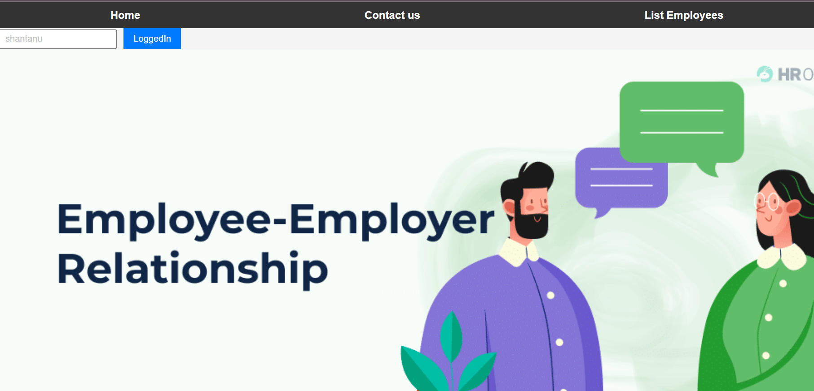
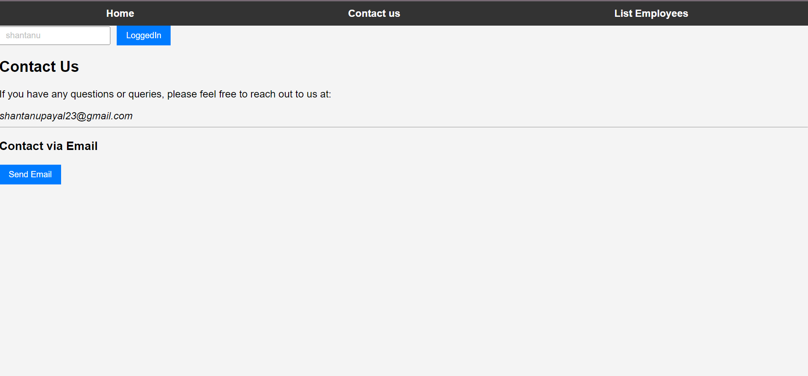
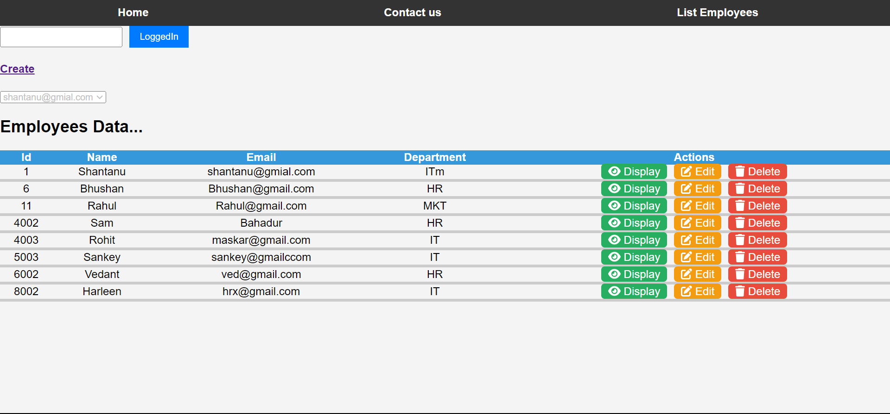

# Employee Management System-WebAPI REST

Welcome to the Employee Management System project! This project is designed to showcase CRUD (Create, Read, Update, Delete) operations while leveraging a full-stack development approach. The system utilizes React for the front end, SQL Server for the database, and a .NET Web API project in C# for the middle tier, following the MVC (Model-View-Controller) architecture.

## Technologies Used

- **Frontend:** React
- **Backend:** .NET Web API (C#)
- **Database:** SQL Server
- **Documentation:** Swagger

## Features

- **CRUD Operations:** Perform Create, Read, Update, and Delete operations on employee records.
- **MVC Architecture:** Utilize the Model-View-Controller architectural pattern for a clean and organized codebase.
- **Repository Pattern:** Employ repositories for specific purposes, enhancing code maintainability and separation of concerns.
- **CORS (Cross-Origin Resource Sharing):** Enable cross-origin communication for better integration and flexibility.
- **Swagger:** Leverage Swagger tool for API documentation and testing backend functionality through the provided URLs.

### Prerequisites

- Node.js and npm for React development
- Visual Studio for .NET Web API development
- SQL Server for database operations

### Home Page - Logged In Status

### Contact Us - Feedback and Enquiry

### Employee List - CRUD Operations

